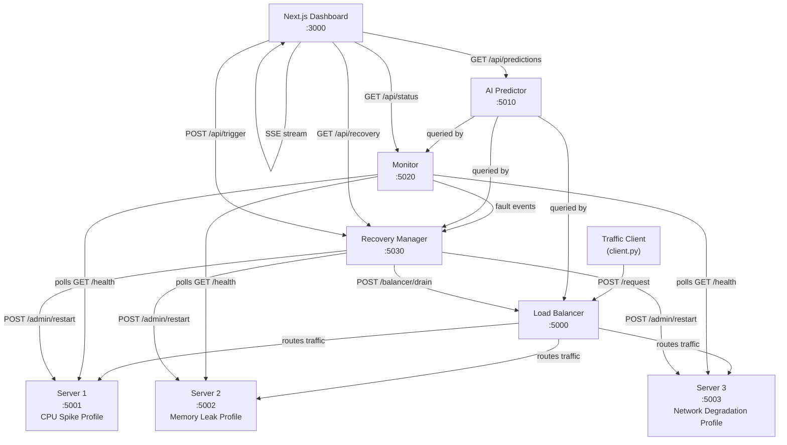
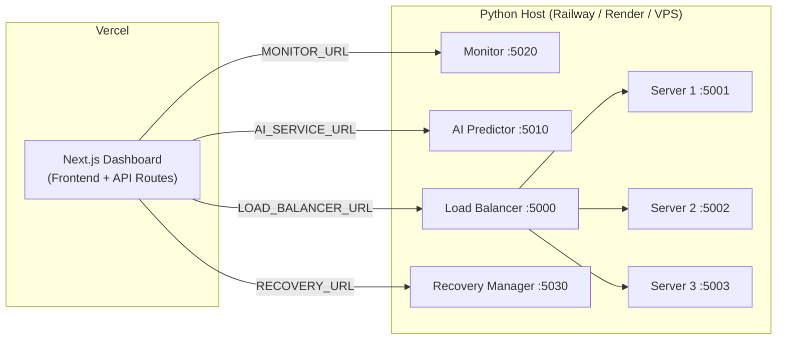

# AI Detection: Distributed AI Fault Detection & Self-Healing System

Build a full-stack, distributed AI-based fault detection and self-healing system. The system's core value proposition is **predicting server failures before they happen** and automatically recovering from them — eliminating downtime rather than just responding to it.

Traditional monitoring reacts to outages. This system prevents them. It watches server metrics in real time, learns what healthy behaviour looks like, detects subtle early-warning patterns in the data, acts autonomously to reroute traffic and trigger recovery, and explains its reasoning to operators through a live observability dashboard.

## Architecture



## Prerequisites

- **Python**: 3.10+
- **Node.js**: 18+
- **Package Managers**: pip, npm

## Installation

```bash
git clone https://github.com/Eliora-12/ai_detection.git
cd ai_detection
npm install
pip install -r requirements.txt
```

## Running the System

### 1. Start Python Backend Services
Starts all microservices (Servers, Monitor, AI Predictor, Load Balancer, Recovery Manager).
```bash
python run_all.py
```

### 2. Start Next.js Dashboard
```bash
npm run dev
```
The dashboard is available at [http://localhost:3000](http://localhost:3000).

## Deploying to Vercel

### Architecture Note

Vercel hosts only the **Next.js frontend**. The Python microservices (servers, monitor, AI predictor, load balancer, recovery manager) must be deployed separately to a platform that supports long-running Python processes (e.g. Railway, Render, Fly.io, or a VPS). The Vercel dashboard connects to those services via environment variables.



### Option 1: Deploy via Vercel CLI (Recommended)

```bash
# Install Vercel CLI
npm install -g vercel

# From the project root
vercel

# Follow the prompts:
# - Link to your Vercel account
# - Set project name: ai-detection
# - Framework: Next.js (auto-detected)
# - Root directory: ./  (project root)

# Deploy to production
vercel --prod
```

### Option 2: Deploy via Vercel Dashboard (GitHub Integration)

1. Go to [https://vercel.com/new](https://vercel.com/new)
2. Click **"Import Git Repository"** and select `Eliora-12/ai_detection`
3. Set the framework preset to **Next.js**
4. Set the root directory to `.`
5. Under **"Build & Output Settings"**, confirm:
   - Build command: `npm run build`
   - Output directory: `.next`
   - Install command: `npm install`
6. Under **"Environment Variables"**, add all four variables:
   | Variable | Value |
   |---|---|
   | `MONITOR_URL` | URL of your deployed monitor service |
   | `AI_SERVICE_URL` | URL of your deployed AI predictor service |
   | `LOAD_BALANCER_URL` | URL of your deployed load balancer |
   | `RECOVERY_URL` | URL of your deployed recovery manager |
7. Click **Deploy**

## Deploying Python Services to Railway

### Prerequisites
- A Railway account at [https://railway.app](https://railway.app)
- Railway CLI installed: `npm install -g @railway/cli`
- The Vercel dashboard already deployed at `https://ai-detection-liart.vercel.app`

### Step 1 — Create a New Railway Project

```bash
railway login
railway init
# Name the project: ai-detection-backend
```

Or via the Railway dashboard at [https://railway.app/new](https://railway.app/new) — select "Deploy from GitHub repo" and connect `Eliora-12/ai_detection`.

### Step 2 — Add Each Service

In the Railway dashboard, add 7 services to the project, one per Python microservice. For each:

1. Click **"+ New Service"** → **"GitHub Repo"**
2. Select `Eliora-12/ai_detection`
3. Set the **Root Directory** to `python/` (or the specific service subdirectory)
4. Set the **Start Command** to the appropriate command (e.g. `python python/servers/server1.py`)
5. Set the **Health Check Path** to `/health`

### Step 3 — Set Environment Variables in Railway

For each service, set the environment variables it needs to reach its dependencies. In the Railway dashboard under each service → **Variables**:

**Monitor service:**
```
SERVER1_URL=<Railway URL of server1 service>
SERVER2_URL=<Railway URL of server2 service>
SERVER3_URL=<Railway URL of server3 service>
AI_SERVICE_URL=<Railway URL of AI predictor service>
```

**Load Balancer:**
```
SERVER1_URL=<Railway URL of server1 service>
SERVER2_URL=<Railway URL of server2 service>
SERVER3_URL=<Railway URL of server3 service>
AI_SERVICE_URL=<Railway URL of AI predictor service>
```

**Recovery Manager:**
```
MONITOR_URL=<Railway URL of monitor service>
AI_SERVICE_URL=<Railway URL of AI predictor service>
LOAD_BALANCER_URL=<Railway URL of load balancer service>
SERVER1_URL=<Railway URL of server1 service>
SERVER2_URL=<Railway URL of server2 service>
SERVER3_URL=<Railway URL of server3 service>
```

**Server 1, 2, 3:** No inter-service env vars needed.

### Step 4 — Get Public URLs and Update Vercel

Once all services are deployed and healthy (green in Railway dashboard):

1. Note the public Railway URLs for: Monitor, AI Predictor, Load Balancer, Recovery Manager
2. Go to the Vercel dashboard → `ai-detection` project → **Settings → Environment Variables**
3. Update all four variables:
   ```
   MONITOR_URL=https://<monitor-service>.railway.app
   AI_SERVICE_URL=https://<ai-predictor-service>.railway.app
   LOAD_BALANCER_URL=https://<load-balancer-service>.railway.app
   RECOVERY_URL=https://<recovery-service>.railway.app
   ```
4. Trigger a **Redeploy** on Vercel

### Step 5 — Verify the Live System

Visit `https://ai-detection-liart.vercel.app` — the dashboard should now show:
- Live server health cards for Server 1, 2, and 3
- Real-time AI predictions updating via SSE
- Recovery events populating as faults are detected and resolved

### Troubleshooting Railway Deployments

| Problem | Solution |
|---|---|
| Service crashes immediately on start | Check Railway logs — likely a missing env var or port binding issue |
| Services can't reach each other | Confirm inter-service URLs are set correctly in Railway Variables |
| Dashboard still shows offline after connecting | Confirm CORS is configured for `https://ai-detection-liart.vercel.app` in all 4 public services |
| Health check failing | Ensure `GET /health` returns HTTP 200 on all services |
| AI predictor crashes with model not found | The model `.pkl` file may not be committed — ensure `python/ai/model/` contains the trained model files or add a startup training step |

### Connecting to Live Python Services

Once the Vercel deployment is live, it serves as a functional dashboard shell. To connect it to real running Python services:

1. Deploy the Python services to a host that supports persistent Python processes.
2. Start each service and note its public URL.
3. In the Vercel dashboard, go to **Settings → Environment Variables**.
4. Update each of the four variables with the real public URLs.
5. Trigger a **Redeploy** for the changes to take effect.

### Verifying the Deployment

| URL | Expected Response |
|---|---|
| `https://<your-vercel-url>.vercel.app` | Dashboard loads, shows offline banner if no Python services connected |
| `https://<your-vercel-url>.vercel.app/api/status` | `{ "error": true, "message": "Service unavailable..." }` or live data |
| `https://<your-vercel-url>.vercel.app/api/stream` | SSE stream opens (may return empty events if services offline) |

### SSE on Vercel — Important Note

Vercel serverless functions have a maximum execution duration. The SSE stream at `/api/stream` is configured to automatically close and prompt the client to reconnect every 25 seconds, which keeps it within Vercel's limits. This reconnection is handled automatically by the frontend.

### Troubleshooting

| Problem | Solution |
|---|---|
| Build fails with "env var not found" | Ensure all 4 env vars are set in Vercel dashboard before deploying |
| Dashboard shows servers as offline | Python services are not yet deployed or env vars point to wrong URLs |
| SSE stream disconnects immediately | Check that `maxDuration = 25` is exported from `app/api/stream/route.ts` |
| CORS errors in browser console | Confirm `vercel.json` CORS headers are present in the deployment |
| TypeScript build errors | Run `npx tsc --noEmit` locally and fix all errors before pushing |

## Environment Variables

| Variable | Default | Description |
|---|---|---|
| `MONITOR_URL` | `http://localhost:5020` | URL of the Monitor service |
| `AI_SERVICE_URL` | `http://localhost:5010` | URL of the AI Predictor service |
| `LOAD_BALANCER_URL` | `http://localhost:5000` | URL of the Load Balancer |
| `RECOVERY_URL` | `http://localhost:5030` | URL of the Recovery Manager |

## Running Tests

```bash
pytest tests/unit -v           # Python unit tests
pytest tests/integration -v    # Full system integration test
npm run test:components         # Next.js component tests
```

## Component Descriptions

- **Servers**: Three independent Flask processes simulating diverse failure modes: `server1` (CPU spikes), `server2` (Memory leaks), and `server3` (Network degradation).
- **Monitor**: Continuously polls server health, identifies metric trends (using slope analysis), and emits `fault_detected` events.
- **AI Predictor**: A FastAPI microservice using `scikit-learn` (Isolation Forest + Random Forest) to predict failures and provide natural language explanations.
- **Load Balancer**: Routes incoming traffic using strategies like `ai_guided`, which drains traffic from servers with high predicted fault probabilities.
- **Recovery Manager**: Listens to AI predictions and executes autonomous recovery actions (e.g., graceful restarts) before a total failure occurs.
- **Dashboard**: A real-time Next.js application showing live server health, AI reasoning, and recovery logs via SSE.
- **Traffic Client**: Generates realistic traffic and stress modes to validate system resilience.

## Example AI Prediction Response

```json
{
  "server_id": "server2",
  "is_anomaly": true,
  "fault_probability": 0.87,
  "fault_type": "memory_leak",
  "recommended_action": "restart",
  "confidence": 0.91,
  "feature_importances": {
    "memory_delta": 0.41,
    "memory_rolling_avg_10": 0.28
  },
  "explanation": "Detected memory_leak pattern with 91.0% confidence. This is an anomalous state for the server."
}
```

## Example Recovery Log Entry

```json
{
  "timestamp": "2024-01-01T12:00:00.000Z",
  "server_id": "server2",
  "trigger": "ai_prediction",
  "fault_type": "memory_leak",
  "action_taken": "restart",
  "action_confidence": 0.91,
  "outcome": "success",
  "recovery_time_ms": 6200,
  "auto_or_manual": "auto"
}
```

## Testing & Stress Tools

### Manual Fault Injection
You can manually trigger a failure on any server to test the recovery loop:
```bash
curl -X POST http://localhost:5002/admin/inject-fault \
     -H "Content-Type: application/json" \
     -d '{"fault_type": "cpu_spike", "severity": "high"}'
```

### Traffic Generator
Use the traffic client to simulate load:
```bash
python python/client/client.py --rate 10    # 10 requests per second
python python/client/client.py --stress     # Burst of 50 requests per second
```

## Phased Development Summary

- **Phase 1**: Foundation, shared configuration, and structured logging.
- **Phase 2**: Three Flask servers with unique fault profiles.
- **Phase 3**: Monitor service with trend-based early fault detection.
- **Phase 4**: AI service with anomaly detection and fault classification.
- **Phase 5**: Intelligent Load Balancer with AI-guided traffic draining.
- **Phase 6**: Autonomous Recovery Orchestrator with fatigue suppression.
- **Phase 7**: Real-time Next.js Dashboard with SSE updates.
- **Phase 8**: Traffic client and stress testing tools.
- **Phase 9**: Full test suite and comprehensive documentation.

*Note: `data/logs.json` and `data/recovery_log.json` are seeded as empty arrays `[]` for a clean first start.*
